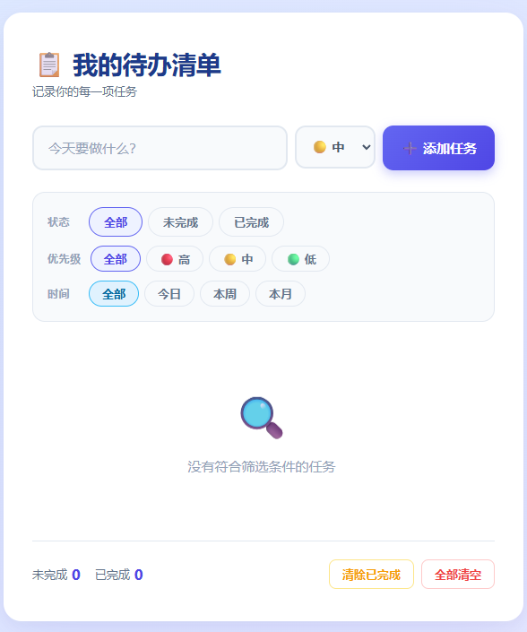

<!-- ===== Vibe Coding 作品集（三列网格） ===== -->
<h2 align="center">Vibe Coding Playground</h2>

  <!-- 项目 1 -->
    <td align="center" width="33%">
      
       
      <b>🪄 todo-list </b>
       
      本地待办事项清单
       
      
    https://todo-app-web-develop-78mx.bolt.host

<!--
**mixiutiamo/mixiutiamo** is a ✨ _special_ ✨ repository because its `README.md` (this file) appears on your GitHub profile.

Here are some ideas to get you started:

- 🔭 I’m currently working on ...
- 🌱 I’m currently learning ...
- 👯 I’m looking to collaborate on ...
- 🤔 I’m looking for help with ...
- 💬 Ask me about ...
- 📫 How to reach me: ...
- 😄 Pronouns: ...
- ⚡ Fun fact: ...
-->
